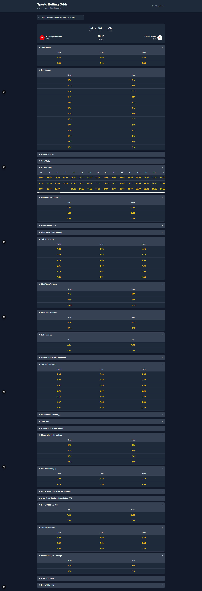

# Sports Betting Odds Table App output




## 🚀 Quick Start

### Prerequisites
- Node.js 18+ 
- npm or yarn package manager

### Installation

1. **Clone the repository**
   ```bash
   git clone <your-repo-url>
   cd odds-table-app
   ```

2. **Install dependencies**
   ```bash
   npm install
   # or
   yarn install
   ```

3. **Add your data file**
   - Place your `data.json` file in the `public/` directory
   - Ensure it follows the required JSON structure (see Data Format section)

4. **Start the development server**
   ```bash
   npm run dev
   # or
   yarn dev
   ```

5. **Open your browser**
   - Navigate to [http://localhost:3000](http://localhost:3000)
   - Start searching for matches!


## 🛠️ Technology Stack

- **Framework**: Next.js 14 (App Router)
- **Styling**: Tailwind CSS
- **Language**: JavaScript (ES6+)
- **State Management**: React Hooks
- **Data**: JSON file-based storage

## 📱 Usage Guide

### Searching for Matches
1. Use the search bar at the top of the page
2. Type a Match ID (e.g., "1000") or team name (e.g., "Philadelphia")
3. Select from the dropdown suggestions
4. View the match details and odds


## 📝 Scripts

```bash
# Development
npm run dev          # Start development server
npm run build        # Build for production
npm run start        # Start production server
npm run lint         # Run ESLint

# Testing
npm run test         # Run tests (if configured)
```


## 🐛 Troubleshooting

### Common Issues

**Data not loading?**
- Ensure `data.json` is in the `public/` directory
- Check the JSON format matches the required structure
- Verify the file is accessible via `/data.json` URL

**Styling issues?**
- Make sure Tailwind CSS is properly installed
- Check that all CSS classes are being applied
- Verify the build process is working correctly

**Search not working?**
- Check the data structure matches the expected format
- Verify team names and IDs are present in the data
- Check browser console for any JavaScript errors

## 📞 Support

If you encounter any issues or have questions:
1. Check the troubleshooting section above
2. Review the code comments for implementation details
3. Open an issue on GitHub with detailed information

---

**Built with ❤️ using Next.js and Tailwind CSS**
